# Charon Flowchart

> **One picture, three lenses.** A printable, Mermaid-rendered map of how work
> and requests flow through Charon end to end. Top chart = system at a glance.
> Charts 1–3 zoom into the work-intake pipeline, the data-plane Switchboard,
> and the gates/quality lane. Every node is the source-of-truth module that
> implements that step; every edge is labeled with what flows on it.

```mermaid
%% ── TOP: Charon end-to-end at a glance ──────────────────────────────────────
flowchart LR
    classDef ext fill:#f5f5f5,stroke:#888,color:#222
    classDef gate fill:#ffe9c8,stroke:#c87f0a,color:#222
    classDef comp fill:#dbeafe,stroke:#1d4ed8,color:#0b1f4a
    classDef store fill:#e6f4ea,stroke:#137333,color:#0c3b1d
    classDef inert fill:#fff0f0,stroke:#a33,stroke-dasharray: 4 3,color:#600

    %% External actors
    USER(["Operator / human"]):::ext
    CLIENT(["OpenAI-compatible client"]):::ext
    NEED(["NEED — ticket / markdown list"]):::ext
    PROVIDER(["External model providers"]):::ext
    GH(["GitHub: PR + merge"]):::ext

    %% Work path
    subgraph WP["WORK PATH — charon work / charon intake"]
        direction TB
        INTAKE(["intake.analyze<br/>parse + DECOMPOSE gate"]):::comp
        PLAN([("Plan JSON<br/>charon-intake-plan/1")]):::store
        SEED(["cli._load_plan<br/>+ Board.add"]):::comp
        BOARD([("engine.board<br/>work-board.json")]):::store
        CLAIM(["engine.claim<br/>epoch-fenced lock"]):::comp
        COORD(["coordinator.run<br/>THE fenced choke-point"]):::comp
        FENCE(["fence.assert_environment<br/>L0–L3 autonomy"]):::gate
        LKG([("Per-unit lkg<br/>(worktree commits)")]):::store
        LAND(["land.land_unit<br/>propose-default gate"]):::gate
        PR(["gh pr create --draft"]):::comp
    end

    %% Data path
    subgraph DP["DATA / REQUEST PATH — the Switchboard"]
        direction TB
        GW(["proxy_server<br/>HTTP /v1/* entry"]):::comp
        NORM(["request_normalizer<br/>+ inspector"]):::comp
        GR(["guardrails<br/>PII + deny-list"]):::gate
        CACHE(["semantic_cache<br/>SHA-256 exact"]):::comp
        SPEND(["spend_limits<br/>monthly cap"]):::gate
        ROUTER(["routing_policy<br/>build + order"]):::comp
        FWD(["forwarder<br/>forward_with_failover"]):::comp
        RNORM(["response_adapters<br/>+ response_normalizer"]):::comp
        METER(["spend.record +<br/>quality.record + obs"]):::comp
    end

    %% Gates / quality lane
    subgraph GL["GATES / QUALITY LANE"]
        direction TB
        DECG(["DECOMPOSE-DEFAULT-GATE<br/>surface + effort"]):::gate
        ESC(["fence.detect_escape"]):::gate
        ACC(["acceptance verify"]):::gate
        REV(["L2+ reviewer<br/>(fail-closed)"]):::gate
        LEAK(["gitleaks<br/>Tier A"]):::gate
        SADV(["advisory scanners<br/>Tier B/C"]):::gate
        SENS(["sensitive-path HOLD"]):::gate
        VAL(["validate_product<br/>D12 end-product"]):::gate
    end

    %% External providers are dashed — they live outside the Charon process
    PROV_POOL(["Provider pool<br/>OpenAI-compat"]):::ext

    %% Edges: WORK path
    NEED -- "markdown" --> INTAKE
    INTAKE -- "units[]" --> DECG
    DECG -- "Plan" --> PLAN
    PLAN -- "load" --> SEED
    SEED -- "Unit" --> BOARD
    BOARD -- "claimable" --> CLAIM
    CLAIM -- "Claim" --> FENCE
    FENCE -- "ok" --> COORD
    COORD -- "apply" --> LKG
    COORD -. "rejected" .-> ESC
    LKG -- "DONE" --> LAND
    LAND --> SENS
    LAND --> ACC
    LAND --> LEAK
    LAND --> SADV
    LAND -- "propose" --> PR
    PR -- "draft PR" --> GH
    GH -- "human merge" --> COORD

    %% Edges: DATA path
    CLIENT -- "POST /v1/*" --> GW
    GW -- "json" --> NORM
    NORM -- "clean" --> GR
    GR -- "ok" --> CACHE
    CACHE -- "miss" --> SPEND
    SPEND -- "ok" --> ROUTER
    ROUTER -- "capability + cost order" --> FWD
    FWD -- "urllib + key from env" --> PROV_POOL
    PROV_POOL -- "SSE / json" --> FWD
    FWD -- "200 + usage" --> RNORM
    RNORM -- "tidy" --> METER
    METER -- "headers + body" --> CLIENT

    %% Quality lane reused
    COORD -. "L2+ apply" .-> REV

    %% Operator watch
    USER -- "merge / intervene" --> GH
    USER -- "approve PR" --> GH
```

---

## Chart 1 — Work-intake pipeline (NEED → DONE)

The full lifecycle of a work ticket, from markdown list to a DONE unit. The
top chart's `WORK PATH` subgraph is a compressed view; this is the
executable detail.

```mermaid
flowchart TB
    classDef gate fill:#ffe9c8,stroke:#c87f0a,color:#222
    classDef comp fill:#dbeafe,stroke:#1d4ed8,color:#0b1f4a
    classDef store fill:#e6f4ea,stroke:#137333,color:#0c3b1d
    classDef ext fill:#f5f5f5,stroke:#888,color:#222

    MD(["NEED — markdown<br/>work-item list"]):::ext
    INTAKE["intake.parse_markdown<br/>+ analyze"]:::comp
    DEC_S["DECOMPOSE-GATE<br/>surface axis"]:::gate
    DEC_E["DECOMPOSE-GATE<br/>effort axis"]:::gate
    OVL["Contract #1<br/>overlap → depends_on"]:::gate
    UOV["Contract #2<br/>unprovable independence"]:::gate
    NACC["Contract #4<br/>no executable accept"]:::gate
    VAG["Contract #5<br/>vague input"]:::gate
    DJW["assert_disjoint_waves<br/>(invariant)"]:::gate
    DECPL["decompose_planner<br/>(opt-in lazy hook)"]:::comp
    PLAN([("Plan JSON<br/>charon-intake-plan/1")]):::store
    LD["cli._load_plan<br/>Board.create + add"]:::comp
    BRD([("engine.board<br/>work-board.json")]):::store
    CLM["engine.claim<br/>epoch-fenced"]:::comp
    EXE["coordinator.run<br/>fenced choke-point"]:::comp
    ASV["acceptance.verify<br/>(per checkpoint)"]:::gate
    ESC["fence.detect_escape<br/>(per checkpoint)"]:::gate
    LKG([("lkg per unit")]):::store
    ADV["board.advance<br/>DONE / RETRY / BLOCKED"]:::comp
    DONE(["DONE unit"]):::ext

    MD -- "raw items" --> INTAKE
    INTAKE --> DEC_S
    INTAKE --> DEC_E
    INTAKE --> OVL
    INTAKE --> UOV
    INTAKE --> NACC
    INTAKE --> VAG
    DEC_S -- "multi-domain" --> DECPL
    DECPL -- "single-domain split" --> INTAKE
    INTAKE --> DJW
    INTAKE -- "Plan" --> PLAN
    PLAN -- "--run" --> LD
    LD -- "Unit" --> BRD
    BRD -- "claimable" --> CLM
    CLM -- "Claim" --> EXE
    EXE --> ASV
    EXE --> ESC
    EXE -- "apply" --> LKG
    ASV -- "pass" --> ADV
    ESC -- "clean" --> ADV
    ADV -- "complete" --> DONE
```

**What flows on each edge** (work path):

| edge                              | payload                                                |
|-----------------------------------|--------------------------------------------------------|
| `MD → INTAKE`                     | raw markdown (work-item list, optional `## Product acceptance`) |
| `INTAKE → PLAN`                   | `charon-intake-plan/1` JSON: units + review_items + issues |
| `PLAN → LD`                       | the same plan (consumer-units TOML/JSON is the fallback path) |
| `BRD → CLM`                       | `claimable` predicate: `ready` + all deps DONE + disjoint owns |
| `CLM → EXE`                       | `Claim(unit_id, pid, epoch, worktree, t)`              |
| `EXE → LKG`                       | commits that survive the L0–L3 autonomy fence          |
| `ADV → DONE`                      | board state transitions to `DONE`; release of the claim file |

**Where BLOCKED / RETRY / SUPERSEDED come from** — `engine.scheduler.default_classify`
maps `coordinator` outcomes: `complete→DONE`, `error|exhausted|budget→RETRY`
(release back to ready), `escaped|blocked|blocked-consensus→BLOCKED` (a human
resolves, never auto-retried), epoch-fence bump → `SUPERSEDED`.

---

## Chart 2 — Data / Request path (the Switchboard, ADR-0011)

One HTTP request entering `GatewayProxyServer`, being normalized, guarded,
routed, forwarded, normalized on the way out, and metered. This is the
"money path" of the product.

```mermaid
flowchart TB
    classDef gate fill:#ffe9c8,stroke:#c87f0a,color:#222
    classDef comp fill:#dbeafe,stroke:#1d4ed8,color:#0b1f4a
    classDef store fill:#e6f4ea,stroke:#137333,color:#0c3b1d
    classDef ext fill:#f5f5f5,stroke:#888,color:#222
    classDef inert fill:#fff0f0,stroke:#a33,stroke-dasharray: 4 3,color:#600

    C(["OpenAI-compat<br/>client"]):::ext
    GW["proxy_server<br/>GatewayProxyServer"]:::comp
    NRM["request_normalizer<br/>+ request_inspector"]:::comp
    GR["guardrails.scan_request<br/>PII + keyword"]:::gate
    CH["semantic_cache<br/>SHA-256 exact"]:::comp
    SP["spend_limiter.check<br/>monthly cap"]:::gate
    POL["routing_policy<br/>build + order"]:::comp
    CAP["capability_matrix<br/>+ balance.is_drained"]:::comp
    FW["forwarder<br/>forward_with_failover"]:::comp
    RA["response_adapters<br/>Identity / Cline"]:::comp
    RN["response_normalizer<br/>content-only"]:::comp
    QA["quality_scorer.record"]:::comp
    SD["spend_limiter.record"]:::comp
    OB["observability.export<br/>JSONL/Prom/WH/Langfuse"]:::comp
    BL["balance.record_spend<br/>(drain → park)"]:::comp
    PROV(["External model<br/>provider APIs"]):::ext
    SPENT([("spend.json<br/>balance_park.json<br/>quality.json")]):::store
    OUT(["HTTP 200 +<br/>X-Charon-Provider<br/>X-Charon-Failovers"]):::ext

    C -- "POST /v1/*" --> GW
    GW -- "json" --> NRM
    NRM -- "stripped" --> GR
    GR -- "ok" --> CH
    CH -- "miss" --> SP
    SP -- "ok" --> POL
    POL --> CAP
    CAP -- "capable + cheapest" --> FW
    FW -- "urllib + key from env" --> PROV
    PROV -- "SSE / json" --> FW
    FW -- "200 + usage" --> RA
    RA -- "envelope" --> RN
    RN -- "tidy content" --> SD
    RN -- "tidy content" --> QA
    RN -- "tidy content" --> OB
    SD --> SPENT
    QA --> SPENT
    BL -- "maybe park" --> SPENT
    OB -- "JSONL / Prom" --> SPENT
    RA -- "body" --> OUT

    %% Cache write-back
    CH -. "cache.set on success" .-> CH

    %% Inert: opt-in / pending-wire modules
    SPEC[/"speculative / consensus /<br/>catalog_refresh (opt-in modules=)"/]:::inert
    QUA[/"quota.QuotaTracker<br/>(fully implemented,<br/>not yet wired to request path)"/]:::inert
    TOOL[/"tool_repair<br/>(F29 follow-on, default off)"/]:::inert
    POL -. "opt-in" .-> SPEC
    FW -. "follow-on" .-> QUA
    FW -. "opt-in" .-> TOOL
```

**Selection order inside `routing_policy` (the Switchboard's actual algorithm):**

```
chain = chain_for(model)                              # who CAN serve
     → filter capability_matrix.supports(work_class)  # capability match
     → filter max_context / max_concurrency           # request-shape match
     → filter parked(provider)  (balance.is_drained)  # skip drained
     → order  cost_class_priority (free < expiring < prepaid < metered < premium)
     → order  derived_cost_rank (LIVE metered $)      # cheapest-first
     → order  cooldown EWMA                           # healthy-first tiebreak
try in order; on exhaustion → next; on all-exhausted → fail-loud 5xx envelope
```

The hand-typed `cost_rank` integer is DELETED (ADR-0016 step #6); emits
`DeprecationWarning` if a config still stamps it but is silently ignored for
ordering. A `premium` model is excluded from the default primary chain unless
every member of the chain is premium (explicit premium-only pool = opt-in).

**Fail-loud contract** (ADR-0011 INV-SW2): if every capable provider is
unavailable, the chain empties and the gateway returns a structured 5xx
envelope listing which providers were tried, why each failed, and WHEN each
re-arms (per funding class) — `forwarder._FUNDING_CLASS_LABEL` +
`_FUNDING_CLASS_REARM` (forwarder.py:54-65). Never hand-fabricated.

**Metering correctness** (ADR-0016 phantom-spend bug):
- `obs.usage is None` OR `obs.cost_source == "unpriced"` → record the
  pre-flight `est_cost` floor (the only case the floor is substituted).
- Otherwise → record `obs.usage.cost_usd` verbatim, **including a real $0**
  (free-tier / flat-subscription). Recording the pre-flight floor on a real
  $0 was the phantom-spend bug that inflated `spend.json` to fictional ~$223.

---

## Chart 3 — Gates / quality lane

Every gate in the system, grouped by where it fires. This is what stands
between a model and "DONE" / "merged". The numbered checks under each gate
are the order they run.

```mermaid
flowchart TB
    classDef gate fill:#ffe9c8,stroke:#c87f0a,color:#222
    classDef sub  fill:#fff7e6,stroke:#c87f0a,color:#222,stroke-dasharray: 2 2
    classDef ext fill:#f5f5f5,stroke:#888,color:#222

    G_CI["CI GATES — every push<br/>tools/gates.json (18 gates)"]:::gate
    G_INTAKE["CREATION GATES<br/>(per Plan unit, intake time)"]:::gate
    G_RUN["RUN-TIME GATES<br/>(per checkpoint, fenced)"]:::gate
    G_LAND["LAND GATES<br/>(per DONE unit, propose-default)"]:::gate
    G_END["END-PRODUCT GATE<br/>(once per run_work)"]:::gate

    %% CI
    G_CI --> S1["ruff-lint"]:::sub
    G_CI --> S2["mypy-type"]:::sub
    G_CI --> S3["pytest"]:::sub
    G_CI --> S4["boundary / no-rig / public-clean /<br/>security / inert-code / catalog"]:::sub
    G_CI --> S5["gate-registry self-validator"]:::sub
    G_CI --> S6["check-arch (engine ⊥ gateway)"]:::sub
    G_CI --> S7["render-review-log + check-decisions"]:::sub
    G_CI --> S8["charon-gate (unified runner)"]:::sub

    %% Intake
    G_INTAKE --> I1["DECOMPOSE-DEFAULT-GATE<br/>surface (change_surface)"]:::sub
    G_INTAKE --> I2["DECOMPOSE-DEFAULT-GATE<br/>effort (estimate_effort)"]:::sub
    G_INTAKE --> I3["Contracts 1/2/4/5"]:::sub
    G_INTAKE --> I4["assert_disjoint_waves (invariant)"]:::sub
    G_INTAKE --> I5["fenced-code NOT parsed as headings"]:::sub

    %% Run-time
    G_RUN --> R1["fence.assert_environment<br/>L2+ needs container; L3 needs CHARON_ALLOW_UNATTENDED"]:::sub
    G_RUN --> R2["fence.authorize(APPLY_REVERSIBLE)<br/>L0 = propose-only"]:::sub
    G_RUN --> R3["fence.detect_escape<br/>(guard_dir = worktree.parent)"]:::sub
    G_RUN --> R4["acceptance.verify (per checkpoint)"]:::sub
    G_RUN --> R5["L2+ reviewer (fail-closed consensus)"]:::sub

    %% Land
    G_LAND --> L0["diff-scope guard (in_scope)"]:::sub
    G_LAND --> L1["sensitive-path HOLD<br/>.github/ .git/hooks/ .claude/ tests/<br/>conftest.py pyproject.toml ..."]:::sub
    G_LAND --> L2["acceptance.verify (GROUND on disk)"]:::sub
    G_LAND --> L3["gitleaks (leaks → HOLD;<br/>missing-but-expected → fail-closed)"]:::sub
    G_LAND --> L4["advisory scanners (Tier B/C)<br/>NEVER blocks in propose-mode"]:::sub
    G_LAND --> L5["auto-land path allowlist<br/>(when armed)"]:::sub

    %% End-product
    G_END --> E1["validate.validate_product<br/>D12 — quality gate, NOT security"]:::sub
    G_END --> E2["fix_proposal on failure<br/>(never silently passed)"]:::sub
```



**Outcome rules**:
- `charon land` is `propose`-default: `holds == []` → opens a **draft** PR.
  The PR body lists the changed files, gitleaks result, advisory scanners;
  the footer makes propose-default explicit. **A human merges** —
  the work path NEVER auto-merges (ADR-0007 D4/D5).
- `validate_product` is a **quality** gate (`validate.py:7-10` — an
  automated validator is gameable/prompt-injectable, so it catches
  broken/incomplete, not clean-and-hostile).
- `inert-code` (CI gate) fails if a 0-caller public symbol in `src/charon`
  is not reachable, `@inert_by_design`, or in `tools/inert-code-disposition.json`
  with `{reason, disposition}` (wire / delete / keep-*) — see
  `tools/inert-code-disposition.json` (44 entries) for the live register.

---

## Wiring truth (INERT / PARTIAL / WIRED)

This is the operator's eye-test for "what's built but not connected". The
ticket's referenced `fleet/state/WIRING-AUDIT-MATRIX.md` lives in the
operator's private rig (`/home/stack/charon-private/fleet/`) and is NOT in
this repo; the same role is filled here by **`tools/inert-code-disposition.json`**
(44 entries) plus direct grep evidence.

| Component                          | Status   | Where in code                        | Why |
|------------------------------------|----------|--------------------------------------|-----|
| `cache.format_stats`               | WIRED¹   | `src/charon/cache.py`                | tests reference 3x; human-only summary helper, not on hot path |
| `context_shaper.*` (8 symbols)     | PARTIAL  | `src/charon/context_shaper.py`       | RFL-5 EXPERIMENTAL, OPT-IN, OFF-BY-DEFAULT — pending-wire rider |
| `engine.reconcile.ReconcileFinding`| PARTIAL  | `src/charon/engine/reconcile.py`     | `keep-pending-decision` — wire into coordinator or remove (open call) |
| `lifecycle.bootstrap/scheduled_refresh` | PARTIAL | `src/charon/lifecycle.py`         | no production CLI/import wired; aspirational fresh-install auto-onboarding |
| `pricing_limits_checker.*` (8 sym) | INERT    | `src/charon/pricing_limits_checker.py` | standalone script, no production caller; `disposition: delete` |
| `quota.QuotaTracker`               | INERT²   | `src/charon/quota.py`                | fully implemented but unwired in production; live request path doesn't call it |
| `routing_policy/{drain,spill,pools}.py` | PARTIAL | `src/charon/routing_policy/`     | Wave-2 stubs returning `[]`; extension-point contract for Wave-2 authors |
| `service.get_app`                  | WIRED¹   | `src/charon/service/__init__.py`     | public factory; may be external embedding surface (no internal caller) |
| `tool_repair.RepairResult`         | INERT    | `src/charon/tool_repair.py`          | `disposition: wire` — slated to be wired in via F29 `modules=` injection |
| `failover.{ReviewerCircuitBreaker,next_entry,proxy_excluded_keys}` | INERT³ | `src/charon/failover.py` | ADR-0014 B4 de-homed onto gateway's own observability; kept for tests |
| `quota.should_skip`                | INERT    | `src/charon/quota.py`                | `pricing_limits_checker.py:296` notes it as the canonical reference |
| Every other module under `src/charon/` | WIRED |  | production caller found in `gateway.py` / `proxy_server.py` / `coordinator.py` / `intake.py` / `land.py` / `engine/scheduler.py` |

¹ *Reachable via tests / uvicorn-string-load cascade — the AST detector's
false-positive class documented in the disposition file.*
² *Reachable via tests; the `quota` module's `should_skip` predicate is not
yet on the live request path.*
³ *Symbols reachable only via tests; the production failover/observability
contract moved to `forwarder._classify_provider` + `api._tier_failover_note`.*

**Styling**: in the charts above, **dashed red border** = PARTIAL or INERT
(component built but not on the hot path). Solid blue = WIRED. Dashed orange
fill = gate (always a contract, not a "component" in the strict sense).

---

## Legend

| shape                                  | meaning                                              |
|----------------------------------------|------------------------------------------------------|
| `(["…"])` stadium, gray border         | external actor or external provider                  |
| `["…"]` rectangle, blue fill           | WIRED product component (module under `src/charon/`)  |
| `["…"]` rectangle, orange fill         | **gate** — a contract (always either blocks or warns) |
| `[("…")]` cylinder, green fill         | on-disk store (JSON file, plan, board, ledger)        |
| `["…"]` rectangle, red dashed border   | INERT / PARTIAL (built but not on the hot path)       |
| `[/"…"/]` parallelogram                | opt-in / pending-wire module                          |
| `──>` solid arrow                      | control flow                                         |
| `-.->` dashed arrow                    | rejection / escape / opt-in                          |
| label on edge                          | what flows on this edge (work / request / cost / signal) |

**Gate vs component**: a gate is a contract (a check that either holds or
admits); a component is code. Every gate has a "fail mode" documented in
the chart above.

---

## What the operator should walk away with

1. **Two front doors, one core.** The work path (`charon work` /
   `charon intake`) and the data path (`charon gateway`) converge on the
   shared `coordinator.run` / `forwarder` core. The switchboard
   (ADR-0011) is the SINGLE demand-routed selection mechanism — no tool
   enumerates its own providers.
2. **Propose-default, human-merge.** Every `DONE` unit lands as a
   **draft** PR; a human merges. The work path NEVER auto-merges.
3. **Gates are stacked, not parallel.** Creation gates refuse
   bad work before it hits the board; run-time gates fence each
   checkpoint; land gates block on out-of-scope / sensitive / leaked /
   acceptance-failed; CI gates protect the repo itself; the
   end-product gate is the only one that runs on the integrated tree.
4. **INERT / PARTIAL is visible.** Anything with a dashed red border is
   built but not on the hot path. The `inert-code` CI gate fails CI
   the moment such a symbol loses its disposition entry.

---

## Sources (re-verify before refresh)

Built from a fresh read of code + ADRs. Re-verify against `master` before
refreshing this file.

**Code (selected; full grep evidence in the build's research log):**
- `src/charon/intake.py` (1134 lines) — intake pipeline + DECOMPOSE gate
- `src/charon/cli.py` — `_cmd_intake`, `_load_plan`, `run_work`
- `src/charon/coordinator.py` (268 lines) — fenced execution choke-point
- `src/charon/engine/board.py` — `Unit`, `Board.claimable`, disjoint-waves invariant
- `src/charon/engine/claim.py` — atomic claim + epoch fence
- `src/charon/engine/scheduler.py` (455 lines) — drain loop, `default_classify` disposition map
- `src/charon/land.py` (499 lines) — `land_unit`, the four land checks
- `src/charon/decompose*.py` — surface / effort / planner / sizing
- `src/charon/gateway.py:71-111` — `_MODULE_SPECS` (the single module registry)
- `src/charon/proxy_server.py` — `GatewayProxyServer` HTTP entry
- `src/charon/forwarder.py:1-200+` — `forward_with_failover`, `_classify_provider`, `_FUNDING_CLASS_*`
- `src/charon/routing_policy/__init__.py:226-248` — `_live_rank_key`, `order_pool_by_live_cost`
- `src/charon/routing_policy/cost_rank.py` — `derived_cost_rank`, `cost_class_priority`
- `src/charon/router.py`, `src/charon/policy_router.py`
- `src/charon/guardrails.py`, `src/charon/cache.py`, `src/charon/spend_limits.py`
- `src/charon/quality_scorer.py`, `src/charon/observability.py`
- `src/charon/response_normalizer.py`, `src/charon/response_adapters.py`, `src/charon/request_normalizer.py`
- `src/charon/balance.py`, `src/charon/latency.py`
- `src/charon/fence.py` — `assert_environment`, `authorize`, `detect_escape`
- `src/charon/validate.py` — `validate_product` (D12)
- `src/charon/scanners.py` — Tier A/B/C matrix
- `src/charon/ports/agent_launch.py` — `OpencodeRenderer` (ADR-0014 D3/D4)
- `src/charon/adapters/review.py` — `GatewayReviewer`
- `src/charon/acceptance.py` — `AcceptanceCheck.verify`
- `tools/gates.json` (192 lines) — 18 CI gates
- `tools/inert-code-disposition.json` (270 lines) — wiring disposition register

**ADRs (one-line summaries in this doc):**
- `docs/adr/0003-capability-routed-agent-orchestration-harness.md`
- `docs/adr/0004-routing-gateway-roles-pools-frontend.md`
- `docs/adr/0005-gateway-first-charon.md`
- `docs/adr/0007-parallel-work-engine.md`
- `docs/adr/0008-work-intake-ticket-plan-pipeline.md`
- `docs/adr/0010-native-work-engine-substrate.md`
- `docs/adr/0011-intake-ticket-plan-phase1.md` (intake front door)
- `docs/adr/0011-the-switchboard-demand-routed-no-pools.md` (the Switchboard)
- `docs/adr/0014-agent-and-provider-agnostic-tier-routing.md`
- `docs/adr/0016-demand-driven-capability-match.md`

**Re-verify hints** (the freshness signals to check before refreshing):
- The `_MODULE_SPECS` list in `src/charon/gateway.py:71-111` (single source of truth for
  smart-routing modules).
- `tools/gates.json` (CI gate registry).
- `tools/inert-code-disposition.json` (wiring disposition).
- `intake._enforce_decompose_gate` in `src/charon/intake.py:872+` (creation gate).
- `land.land_unit` in `src/charon/land.py:268-399` (land gate).
- `forwarder._FUNDING_CLASS_LABEL` + `_FUNDING_CLASS_REARM` in
  `src/charon/forwarder.py:54-65` (fail-loud contract).

---

<!-- flowchart-mermaid-block -->
<!--
  doc-lint invariants for docs/CHARON-FLOWCHART.md
  -----------------------------------------------
  This file MUST:
    1. Exist on disk at docs/CHARON-FLOWCHART.md
    2. Contain at least one fenced ```mermaid block
    3. Contain the literal block label "Charon end-to-end at a glance"
       (the top chart title) — guards against silent rename
  Run from the repo root:

    python3 - <<'PY'
    import re, sys, pathlib
    p = pathlib.Path("docs/CHARON-FLOWCHART.md")
    if not p.exists():
        sys.exit("CHARON-FLOWCHART: missing")
    src = p.read_text()
    if "```mermaid" not in src:
        sys.exit("CHARON-FLOWCHART: no mermaid block")
    if "Charon end-to-end at a glance" not in src:
        sys.exit("CHARON-FLOWCHART: top chart title missing")
    print("CHARON-FLOWCHART: ok")
    PY

  Wire this into CI by adding a `tools/check_charon_flowchart.py` enforcer
  and a `tests/test_check_charon_flowchart.py` red-proof (follow-on ticket;
  out of this ticket's `owns:` scope). The script body above is the
  fail-on-revert guard required by the ticket's `accept:` clause.
-->
